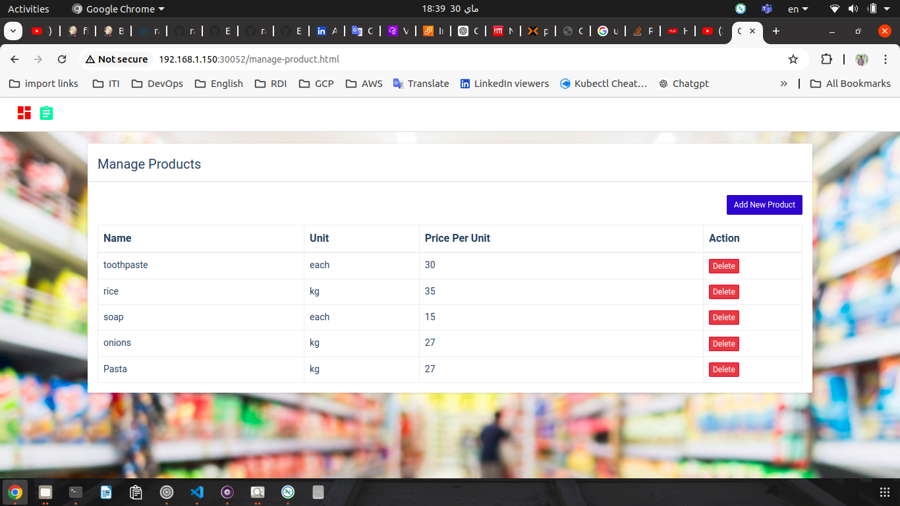
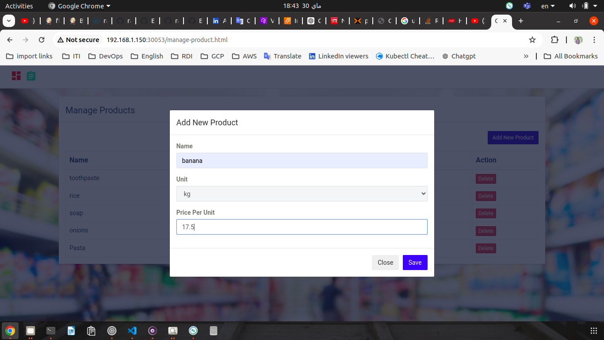
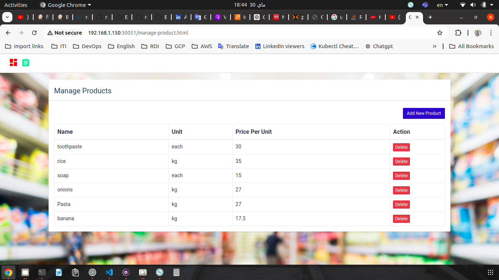
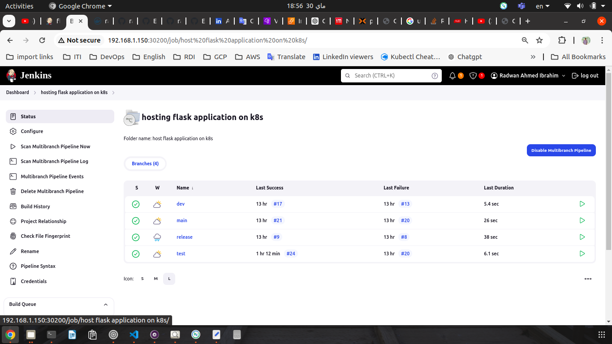

# Deploy full stack flask application on Kubernetes and jenkins
## grocery Flask Website
I set up a Jenkins master and slave on kubernetes cluster with three nodes. During this lab, I implemented a simple Gitflow. For the deployment of the a flask website, I used Jenkins to build the CI/CD multibranch pipeline with branches (main, release, dev, test, prod).
release branch to build image and push it to dockerhub.
and main, dev, test and prod use to pull last version for image from docker hub and deploy it.

I used mariaDB database and Nginx webserver, I used galera cluster for Databases to let the application can use three nodes of mariaDB and I used proxysql as a loadbalancer to achieve high availability to accessing databases nodes.
And I learned how can I achieve security for database connection for image before push it to dockerhub and achieve security for database connection before push my code to git hub.

## To run my kubernetes project
#### first should deploy jenkins nameSpace, jenkins master and it's service 
``` sh 
    $ k apply -f jenkins/jenkins-namespace.yml               # create jenkins namespace 
    $ k apply -f jenkins/pv-pvc.yml                          # create nfs pv and nfs pvc 
    $ k apply -f jenkins/deploy-jenkins.yml                  # create jenkins master and its service
```
#### build slave image and push it to your dockerhub
``` sh
    docker build -t jenkins-slave -f jenkins/jenkinsDockerFile .  
    docker tag jenkins-slave jenkins-slave radwanmaazon/jenkins-slave:ubuntu22
    docker push radwanmaazon/jenkins-slave:ubuntu22
```
    you can replace radwanmaazon by your dockerhub username and you can change the version

### From jenkins master Manage Jenkins --> nodes configure new node to attach the slave to jenkins master 

### Configure multibranch pipeline

## Test Environment with service port 30052

## Dev Environmentwith service port 30053
##### Adding new Item to database 

## production Environment with service port 30051
##### All is Done and should be published 


## Jenkins multibranch pipeline 


## Ownership
|
|:-----------------:|
|[Radwan Maazon](https://github.com/redwan2050)|


